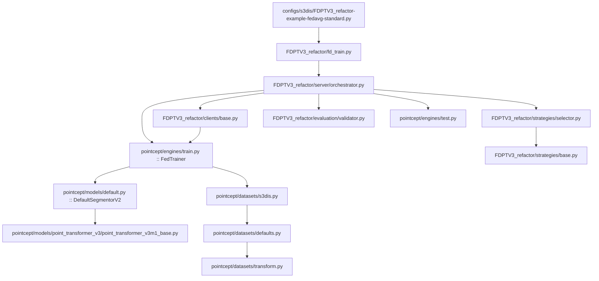

# FDPTV3 Minimal PTv3 S3DIS

这个目录是从原始仓库抽取出的最小联邦训练项目，目标非常单一：

- 基础模型：PointTransformerV3
- 数据集：S3DIS
- 训练模式：联邦学习
- 默认算法：FedAvg

它不是原始仓库的“瘦身镜像”，而是一份围绕单条可解释执行链整理出来的最小项目。

## 当前可行性结论

- 已完成静态链路复核：关键 Python 文件能通过语法编译，pointcept/FDPTV3_refactor 主链没有发现当前默认路径上的本地缺失文件。
- 已修复最小项目中发现的两处自洽性问题：
	- `pointcept/models/default.py` 中的 `DefaultSegmentorV2` 逻辑已恢复为语义分割版本。
	- `pointcept/utils/__init__.py` 已补齐 `comm` 导出，和 `launch.py` 的导入契约保持一致。
- 仍未完成真实运行时验证：当前工作区默认 Python 环境缺少 `torch`，因此我无法在本机当前会话中执行真实训练启动验证。

结论：

- 从源码结构和静态依赖角度，这个最小项目已经接近闭合。
- 从运行角度，它仍然依赖完整深度学习环境和编译算子，是否真正可跑取决于你激活的训练环境。

## 平台与环境边界

推荐平台：

- Linux
- 或 WSL2 + CUDA

不建议默认假设 Windows 原生可以直接运行，原因如下：

- 项目包含 `spconv`、`flash_attn`、`pointops`、`pointgroup_ops` 等编译型依赖。
- 缓存工具依赖 `/dev/shm` 语义。
- 保留的原始启动脚本是 bash 脚本。

最小环境文件是 [environment.yml](environment.yml)。我另外补了两个运行期直接依赖：

- `flwr`
- `SharedArray`

如果你使用的是自己已有的训练环境，至少要确认下面这些包确实可用并与 CUDA / PyTorch 版本匹配：

- `torch`
- `flwr`
- `spconv`
- `torch-scatter`
- `torch-cluster`
- `flash_attn`
- `pointops`
- `pointgroup_ops`
- `tensorboardX`
- `wandb`
- `SharedArray`

## 架构总览



## 顶层目录作用

### [configs](configs)

保存训练配置。当前只保留：

- [configs/_base_/default_runtime.py](configs/_base_/default_runtime.py)：默认运行时、hook、trainer/tester 类型。
- [configs/s3dis/FDPTV3_refactor-example-fedavg-standard.py](configs/s3dis/FDPTV3_refactor-example-fedavg-standard.py)：最小项目的标准入口配置。

### [FDPTV3_refactor](FDPTV3_refactor)

联邦学习主链。

- [FDPTV3_refactor/fd_train.py](FDPTV3_refactor/fd_train.py)：CLI 入口。
- [FDPTV3_refactor/server](FDPTV3_refactor/server)：联邦训练轮次编排、全局模型保存、最终测试。
- [FDPTV3_refactor/clients](FDPTV3_refactor/clients)：客户端本地训练逻辑。
- [FDPTV3_refactor/strategies](FDPTV3_refactor/strategies)：聚合策略选择与服务器包装。
- [FDPTV3_refactor/data_splitter](FDPTV3_refactor/data_splitter)：按用户切分 S3DIS 区域。
- [FDPTV3_refactor/evaluation](FDPTV3_refactor/evaluation)：联邦轮次验证。
- [FDPTV3_refactor/checkpoint](FDPTV3_refactor/checkpoint)：断点恢复与轮次状态保存。
- [FDPTV3_refactor/utils](FDPTV3_refactor/utils)：环境搭建、路径、索引转换、wandb 等辅助功能。

### [pointcept](pointcept)

保留 Pointcept 内部运行链所需的最小部分。

- [pointcept/models](pointcept/models)：`DefaultSegmentorV2`、PTv3、PDNorm、loss、Point 结构。
- [pointcept/datasets](pointcept/datasets)：S3DIS 数据集、默认数据读取、增广、collate。
- [pointcept/engines](pointcept/engines)：配置解析、训练器、测试器、hook。
- [pointcept/utils](pointcept/utils)：config、registry、logger、comm、scheduler 等通用能力。

### [libs](libs)

完整保留原始 CUDA/C++ 扩展目录，不做裁剪。这样你能清楚知道这些编译型依赖仍然来自原项目哪里。

### [scripts](scripts)

启动脚本目录。当前提供：

- [scripts/FDPTV3_refactor_Train.sh](scripts/FDPTV3_refactor_Train.sh)

我另外补了 Windows PowerShell 版脚本：

- [scripts/FDPTV3_refactor_Train.ps1](scripts/FDPTV3_refactor_Train.ps1)

### [tools](tools)

这个目录在最小项目中不是运行必需，只是为了保留原仓库层级感。说明见 [tools/README.md](tools/README.md)。

## 关键文件作用

### 联邦训练入口

- [FDPTV3_refactor/fd_train.py](FDPTV3_refactor/fd_train.py)
	解析命令行配置，构建联邦服务端，并启动整个训练生命周期。

### 联邦总控

- [FDPTV3_refactor/server/orchestrator.py](FDPTV3_refactor/server/orchestrator.py)
	负责：环境初始化、全局模型创建、逐轮调度客户端、本地权重聚合、轮次验证、最终测试。

### 客户端训练

- [FDPTV3_refactor/clients/base.py](FDPTV3_refactor/clients/base.py)
	负责：按用户构造私有配置、设置数据划分、加载全局参数、执行本地训练、上传本地权重。

### 策略选择

- [FDPTV3_refactor/strategies/selector.py](FDPTV3_refactor/strategies/selector.py)
	负责：根据配置选择 `FedAvg/FedProx/FedAdam/FedYogi` 等原生 Flower 策略，并附加服务器调度器。

### 模型主链

- [pointcept/models/default.py](pointcept/models/default.py)
	定义分割头，当前主配置使用 `DefaultSegmentorV2`。
- [pointcept/models/point_transformer_v3/point_transformer_v3m1_base.py](pointcept/models/point_transformer_v3/point_transformer_v3m1_base.py)
	PTv3 主体实现。
- [pointcept/models/point_prompt_training/prompt_driven_normalization.py](pointcept/models/point_prompt_training/prompt_driven_normalization.py)
	提供 PDNorm。

### 数据主链

- [pointcept/datasets/s3dis.py](pointcept/datasets/s3dis.py)
	S3DIS 数据集封装。
- [pointcept/datasets/defaults.py](pointcept/datasets/defaults.py)
	通用数据读取与样本组织。
- [pointcept/datasets/transform.py](pointcept/datasets/transform.py)
	所有训练/验证/测试增广都在这里注册。

### 训练与测试主链

- [pointcept/engines/train.py](pointcept/engines/train.py)
	`FedTrainer` 的实现所在，负责模型、dataloader、optimizer、hook、训练循环。
- [pointcept/engines/test.py](pointcept/engines/test.py)
	最终测试链入口。
- [pointcept/engines/hooks](pointcept/engines/hooks)
	训练过程中的 checkpoint、日志、评估等 hook。

## 启动方法

### 方式一：直接使用 Python 模块入口

在本目录下执行：

```bash
python -m FDPTV3_refactor.fd_train --config-file configs/s3dis/FDPTV3_refactor-example-fedavg-standard.py --options save_path=exp/s3dis/minimal_ptv3
```

如果你在 Windows PowerShell 中：

```powershell
python -m FDPTV3_refactor.fd_train --config-file configs/s3dis/FDPTV3_refactor-example-fedavg-standard.py --options save_path=exp/s3dis/minimal_ptv3
```

### 方式二：使用脚本

Linux / WSL / Git Bash：

```bash
bash scripts/FDPTV3_refactor_Train.sh -d s3dis -c FDPTV3_refactor-example-fedavg-standard -n minimal_ptv3
```

Windows PowerShell：

```powershell
./scripts/FDPTV3_refactor_Train.ps1 -Dataset s3dis -Config FDPTV3_refactor-example-fedavg-standard -ExperimentName minimal_ptv3
```

## 数据要求

- 默认配置数据根目录是 `data/s3dis_normal`。
- S3DIS 区域划分默认使用：`Area_1, Area_2, Area_3, Area_4, Area_6` 训练，`Area_5` 验证/测试。
- 如果你更改数据根目录，需要同步修改 [configs/s3dis/FDPTV3_refactor-example-fedavg-standard.py](configs/s3dis/FDPTV3_refactor-example-fedavg-standard.py)。

## 扩展指南

### 加入新的基础模型

最小流程：

1. 在 [pointcept/models](pointcept/models) 下加入你的新模型目录或文件。
2. 在对应实现中通过 `@MODELS.register_module()` 注册模型。
3. 在 [pointcept/models/__init__.py](pointcept/models/__init__.py) 中导入你的模型模块。
4. 在配置文件里把 `model.backbone.type` 改成你的新类型。

如果新模型需要新的第三方包或 CUDA 算子：

1. 同步补充 [environment.yml](environment.yml)。
2. 如有本地扩展源码，按当前模式放入 [libs](libs)。
3. 在 README 里补清运行前置条件。

### 加入新的数据集

最小流程：

1. 在 [pointcept/datasets](pointcept/datasets) 下新增数据集实现。
2. 用 `@DATASETS.register_module()` 注册数据集类型。
3. 在 [pointcept/datasets/__init__.py](pointcept/datasets/__init__.py) 中导入它。
4. 如果联邦场景需要新的用户划分逻辑，在 [FDPTV3_refactor/data_splitter](FDPTV3_refactor/data_splitter) 下新增 splitter。
5. 在 [FDPTV3_refactor/data_splitter/builder.py](FDPTV3_refactor/data_splitter/builder.py) 中登记映射关系。
6. 新建对应配置文件，参考当前 S3DIS 配置。

### 加入新的联邦聚合算法

1. 在 [FDPTV3_refactor/strategies](FDPTV3_refactor/strategies) 中新增策略实现。
2. 如果是 Flower 原生策略，通常只需要在 [FDPTV3_refactor/strategies/selector.py](FDPTV3_refactor/strategies/selector.py) 增加 builder。
3. 如果是自定义策略，实现后在 [FDPTV3_refactor/registry.py](FDPTV3_refactor/registry.py) 注册。
4. 在配置文件 `federated.aggregation_method` 和 `federated.hyperparameters` 中补对应条目。

## 已知限制

- 当前会话没有激活完整深度学习环境，所以我无法在这里完成真实训练启动验证。
- 当前最小项目保留的是“训练完成后自动执行最终测试”的链路，没有单独整理独立联邦测试 CLI。
- 这个最小项目只承诺覆盖 PTv3 + S3DIS + 联邦训练主链，不覆盖多数据集训练和其他大模型分支。
- [pointcept/engines/train.py](pointcept/engines/train.py) 中的 `MultiDatasetTrainer` 被显式标记为最小项目不支持。

## 推荐使用方式

如果你后续要继续裁剪或扩展，不要直接把这个目录当作“随手改动的试验田”。推荐做法是：

1. 先复制标准配置文件。
2. 只改一条链路，例如模型、数据集或策略中的一种。
3. 每次改完至少做一次 `py_compile` 或真实训练启动验证。
