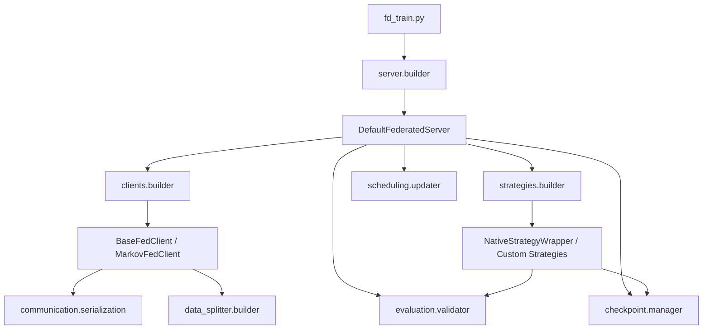

# FDPTV3_refactor

FDPTV3_refactor 是在不破坏原有 FD_PTV3 代码的前提下，对联邦学习部分进行重新组织后的新包。

目标不是重写 Pointcept，也不是重写所有算法，而是把原来混在训练脚本里的联邦职责拆开，形成一个更适合阅读、维护和扩展的结构。

这个包当前已经满足两个要求：

1. 训练和测试入口独立，训练主流程不再堆在一个大脚本里。
2. 新包内部已经不再直接依赖旧包 FD_PTV3 的源码实现，可以独立演进。

## 1. 设计目标

这个重构主要解决四类问题：

1. 角色不清晰。
原来 fd_train.py 同时扮演入口、服务端控制器、策略调度器、验证调度器、断点管理器。

2. 可扩展点分散。
新增客户端、聚合算法、通信模式时，容易回头修改主流程脚本。

3. 配置驱动不稳定。
希望通过配置文件决定服务端、客户端、聚合算法、通信方式，而不是在代码里硬编码条件分支。

4. 后续阅读成本高。
项目需要一条明确的阅读路径，让后续维护者知道先看哪里，再看哪里，以及每一层为什么存在。

## 2. 架构总览

FDPTV3_refactor 按“联邦角色 + 横向能力”组织，而不是按历史脚本拆碎。

一句话概括当前控制流：

1. fd_train.py 负责进入程序。
2. server 层负责联邦训练的总调度。
3. clients 层负责每个客户端如何训练和上传权重。
4. strategies 层负责服务端如何聚合。
5. communication、evaluation、checkpoint、scheduling、data_splitter 提供横向能力。

## 3. 目录说明

### 3.1 顶层入口

fd_train.py

- 联邦训练入口。
- 只负责解析配置并构建服务端。
- 不承载具体联邦训练细节。

fd_test.py

- 联邦模型测试入口。
- 用于加载最终模型权重并执行测试。

registry.py

- 通用注册器。
- 客户端类型和聚合策略类型都通过这里注册。

README.md

- 本文档。
- 用于说明当前包的架构、扩展点、配置方式和阅读顺序。

### 3.2 server

职责：联邦服务端主流程。

server/base.py

- 定义服务端统一接口。
- 当前主要抽象是 BaseFederatedServer。

server/builder.py

- 根据配置构建服务端对象。
- 当前默认服务端类型是 DefaultFederatedServer。

server/orchestrator.py

- 当前联邦训练的核心控制流。
- 包括全局模型初始化、轮次循环、客户端调度、聚合调用、验证、断点保存、训练收尾。

server/state.py

- 定义服务端运行时状态。
- 包括当前轮次、用户数、恢复状态等。

### 3.3 clients

职责：联邦客户端角色。

clients/base.py

- 基础客户端 BaseFedClient。
- 定义客户端训练模板流程：接收参数、构造用户配置、初始化本地训练器、本地训练、提取权重、清理资源、上传结果。

clients/builder.py

- 根据配置选择具体客户端类型。
- 负责构建 client_fn。

clients/binarize.py

- 二值化相关工具。
- 主要服务于结构化/二值化客户端。

clients/types/markov_client.py

- MarkovFedClient。
- 在 BaseFedClient 基础上重写本地权重处理逻辑。

### 3.4 strategies

职责：服务端聚合策略层。

strategies/base.py

- 定义 BaseFederatedStrategy 和 NativeStrategyWrapper。
- BaseFederatedStrategy 负责统一调度器、验证、断点等钩子。
- NativeStrategyWrapper 用于包裹 Flower 原生策略。

strategies/builder.py

- 当前策略构建入口。
- 外部一般只需要调用 build_strategy。

strategies/selector.py

- 策略选择逻辑。
- 区分 Flower 原生策略和自定义策略。

strategies/native.py

- 对外导出 Flower 原生包装器。

strategies/custom/fedavgm.py

- FedAvgM 的自定义服务端聚合实现。

strategies/custom/fed_markov_avg.py

- FedMarkovAvg 的自定义服务端聚合实现。

### 3.5 communication

职责：服务端与客户端之间的参数编解码。

communication/base.py

- 抽象通信编解码接口。

communication/serialization.py

- 标准模式和结构化模式的权重序列化/反序列化实现。
- 是当前通信层最核心的文件。

communication/compression.py

- 当前主要复用结构化压缩打包/解包函数。

### 3.6 evaluation

职责：训练过程中验证与最终测试。

evaluation/metrics.py

- 聚合模型验证指标计算。
- 包括 mIoU、mAcc、allAcc、loss 等统计。

evaluation/validator.py

- 训练阶段调用的验证入口。
- 构建验证集 DataLoader 并调用 metrics.py。

evaluation/tester.py

- 最终测试入口和安全包装。

### 3.7 checkpoint

职责：训练断点和服务端状态持久化。

checkpoint/manager.py

- 保存/加载 resume_state。
- 保存/加载聚合器、调度器等组件状态。

### 3.8 scheduling

职责：服务端学习率和动量调度。

scheduling/lr_schedulers.py

- 服务端学习率调度器实现与构建器。

scheduling/momentum_schedulers.py

- 服务端动量调度器实现与构建器。

scheduling/updater.py

- 调度器统一更新入口。

### 3.9 data_splitter

职责：联邦数据划分。

data_splitter/base_splitter.py

- 数据划分策略抽象基类。

data_splitter/builder.py

- 根据配置构建数据划分器。

data_splitter/default_splitter.py

- 默认拆分器。
- 当数据集没有专门拆分策略时兜底使用。

data_splitter/s3dis_splitter.py

- S3DIS 拆分策略。

data_splitter/scannet200_splitter.py

- ScanNet200 拆分策略。

### 3.10 utils

职责：通用工具。

utils/config.py

- 配置读取与写入。
- 支持点号路径。

utils/environment.py

- 日志与 TensorBoard 初始化。
- 清理旧产物与客户端本地检查点。

utils/wandb.py

- WandB 初始化与状态文件管理。

## 4. 训练主流程

当前最重要的主流程在 server/orchestrator.py，可以按下面理解：

1. 读取配置并执行 default_setup。
2. 初始化日志、TensorBoard、WandB。
3. 初始化全局模型。
4. 根据配置构建聚合策略。
5. 根据配置构建客户端工厂。
6. 进入联邦轮次循环。
7. 每轮遍历所有客户端进行本地训练。
8. 收集客户端更新载荷（arrays、num_examples、metrics）。
9. 调用 strategy.aggregate_client_updates 完成统一聚合入口。
10. 如果是自定义策略，聚合逻辑走 _do_aggregate。
11. 如果是 Flower 原生策略，先将本地客户端更新适配成 FitRes，再走原生 aggregate_fit。
12. 由策略层统一执行验证、断点保存、调度器更新和临时清理。
13. 所有轮次结束后保存最终模型并执行最终测试。

如果你只想抓住这个项目怎么跑，优先看这一个文件。

## 5. 配置体系

### 5.1 为什么 refactor 配置必须是完整副本

这里不是简单的“覆写几项联邦参数”。

Pointcept 的配置文件本身包含完整的训练、模型、数据、测试设置。也就是说，一个可运行配置必须同时包括：

1. Pointcept 训练配置。
2. 联邦学习配置。

因此当前 configs/s3dis/FDPTV3_refactor-*.py 都采用“完整 Pointcept 配置副本 + 改造后的 federated 配置”的方式维护。

这样做的好处是：

1. 单个文件就是一个可运行实验。
2. 后续阅读时不需要在多个文件之间来回猜合并效果。
3. 避免对 federated 这样的嵌套字典做不稳定覆写。

### 5.2 当前提供的示例配置

configs/s3dis/FDPTV3_refactor-example-fedavg-standard.py

- 最传统示例。
- 组合为 FedAvg + DefaultFederatedServer + BaseFedClient + standard 传输。
- 推荐作为阅读起点。

configs/s3dis/FDPTV3_refactor-semseg-pt-v3m1-1-rpe-fixed.py

- refactor 版 FedAvg 配置。

configs/s3dis/FDPTV3_refactor-semseg-ptv3m1-FedAvgM.py

- refactor 版 FedAvgM 配置。

### 5.3 federated 配置字段约定

当前建议关注这些字段：

federated.server.type

- 选择服务端类型。
- 当前默认值是 DefaultFederatedServer。

federated.client.type

- 选择客户端类型。
- 当前可用 BaseFedClient、MarkovFedClient。

federated.client.weight_mode

- standard: 普通逐层数组传输。
- structured: 结构化打包传输。

federated.aggregation_method

- 选择聚合算法。
- 当前可用 FedAvg、FedAvgM、FedProx、FedAdam、FedYogi、FedMarkovAvg。
- orchestrator 不会直接按算法名写分支，而是统一调用 strategy.aggregate_client_updates。
- Flower 原生策略和自定义策略都通过这个统一入口接入主流程。

federated.data_split_strategy

- 决定数据如何分到每个客户端。

federated.hyperparameters

- 算法级超参数。
- 不同聚合算法从这里读取自己的配置块。

## 6. 推荐阅读顺序

如果你后续要读这个包，我建议按下面顺序，不要一上来就看所有文件。

### 6.1 想理解整体怎么跑

1. fd_train.py
2. server/builder.py
3. server/orchestrator.py
4. strategies/builder.py
5. clients/builder.py

### 6.2 想理解客户端怎么训练和上传

1. clients/base.py
2. communication/serialization.py
3. data_splitter/builder.py
4. clients/types/markov_client.py

### 6.3 想理解服务端怎么聚合

1. strategies/base.py
2. strategies/builder.py
3. strategies/selector.py
4. strategies/custom/fedavgm.py
5. strategies/custom/fed_markov_avg.py

### 6.4 想理解训练过程中还做了什么

1. evaluation/validator.py
2. evaluation/metrics.py
3. checkpoint/manager.py
4. scheduling/updater.py
5. utils/environment.py

## 7. 如何新增功能

### 7.1 新增一个客户端

适用场景：

1. 想改变本地训练后上传的权重格式。
2. 想做本地量化、二值化、差分上传。
3. 想增加客户端侧统计信息。

步骤：

1. 在 clients/types 下新增一个文件。
2. 继承 BaseFedClient。
3. 根据需要重写 _process_local_weights，必要时重写 _init_model。
4. 使用 @register_client("YourClientName") 注册。
5. 在配置中设 federated.client.type="YourClientName"。

建议：

1. 不要重写 fit 整个流程，优先复用基类模板。
2. 尽量只改“局部权重处理逻辑”。

### 7.2 新增一个服务端聚合算法

适用场景：

1. 新增自定义服务端聚合。
2. 想在聚合中引入动量、重建、正则或额外统计量。

步骤：

1. 在 strategies/custom 下新增文件。
2. 继承 BaseFederatedStrategy。
3. 实现 _do_aggregate(client_weights, round_idx)。
4. 使用 @register_strategy("YourStrategyName") 注册。
5. 在配置中设 federated.aggregation_method="YourStrategyName"。

建议：

1. 把算法逻辑限制在 _do_aggregate。
2. 不要在算法文件里重新实现验证、断点、调度器更新，那些由基类统一处理。
3. 如果只是想复用 Flower 原生 FedAvg、FedProx、FedAdam、FedYogi，不需要新增策略文件，只需要在配置里切换 federated.aggregation_method。

### 7.3 新增一种通信格式

适用场景：

1. 需要压缩权重。
2. 需要打包额外统计量。
3. 需要上传非标准张量结构。

步骤：

1. 在 communication/serialization.py 中增加新的序列化/反序列化函数，或者在 communication/compression.py 中扩展新的打包方式。
2. 约定新的 mode 名称。
3. 在客户端和策略的反序列化入口中增加模式分支。
4. 在配置中通过 federated.client.weight_mode 切换。

建议：

1. 通信层只做编解码，不做业务聚合。
2. 尽量保证 decode(encode(x)) 的结构一致性。

### 7.4 新增一个数据划分策略

步骤：

1. 在 data_splitter 下新增拆分器文件。
2. 继承 BaseDatasetSplitter。
3. 实现 get_user_split、setup_user_config、validate。
4. 在 data_splitter/builder.py 注册到 _SPLITTER_REGISTRY。
5. 在配置里通过 federated.data_split_strategy 指定。

### 7.5 新增一个服务端调度器

步骤：

1. 在 scheduling/lr_schedulers.py 或 scheduling/momentum_schedulers.py 中新增类。
2. 实现 step。
3. 必要时实现 state_dict/load_state_dict。
4. 注册到对应 registry。
5. 在配置 hyperparameters 中引用。

## 8. 哪些文件最重要

如果后续只允许保留少量核心文件在脑子里，优先记这几个：

1. server/orchestrator.py
2. clients/base.py
3. strategies/base.py
4. strategies/builder.py
5. communication/serialization.py
6. evaluation/metrics.py
7. checkpoint/manager.py

这几个文件基本决定了联邦训练如何组织、如何传输、如何聚合、如何验证、如何恢复。

## 9. 当前默认示例

当前最推荐的默认示例是：

configs/s3dis/FDPTV3_refactor-example-fedavg-standard.py

它对应的是最传统的组合：

1. 服务端: DefaultFederatedServer
2. 聚合算法: FedAvg
3. 客户端: BaseFedClient
4. 通信方式: standard
5. 数据集: S3DIS

这个配置最适合作为：

1. 阅读入口。
2. 调试入口。
3. 开发新功能前的基准模板。

## 10. Flower 复用边界

当前实现不是把联邦训练完全交给 Flower server runtime，而是采用本地 orchestrator + Flower 兼容接口的方式。

明确复用 Flower 的部分：

1. 客户端接口基于 fl.client.NumPyClient。
2. 原生聚合策略复用 Flower 提供的 FedAvg、FedProx、FedAdam、FedYogi。
3. 参数对象和数组转换复用 Flower 的 Parameters、FitRes、Status、ndarrays_to_parameters、parameters_to_ndarrays 等协议对象。
4. 对于原生聚合策略，当前会把本地客户端更新适配成 Flower 期望的 `(ClientProxy, FitRes)` 结构，再调用其 aggregate_fit。

没有完全复用 Flower 的部分：

1. 不使用 Flower 的真实 ClientManager 做客户端调度。
2. 不使用 Flower 的真实 server runtime 驱动整个训练循环。
3. 轮次循环、断点推进、训练收尾依然由 server/orchestrator.py 自己控制。

因此更准确的理解是：

1. 训练控制流主要由我们自己实现。
2. 客户端接口和部分聚合能力复用了 Flower。
3. strategies 层负责把本地 orchestrator 的客户端更新适配到 Flower 原生策略需要的输入结构。

## 11. 训练与测试命令

### 10.1 直接命令

训练：

python -m FDPTV3_refactor.fd_train --config-file configs/s3dis/FDPTV3_refactor-example-fedavg-standard.py --options save_path=exp/s3dis/example_fedavg_standard resume=False

测试：

python -m FDPTV3_refactor.fd_test --config-file configs/s3dis/FDPTV3_refactor-example-fedavg-standard.py --weight exp/s3dis/example_fedavg_standard/final_model.pth --save-path exp/s3dis/example_fedavg_standard/test_result

### 10.2 Shell 脚本

训练脚本：

scripts/FDPTV3_refactor_Train.sh

测试脚本：

scripts/FDPTV3_refactor_Test.sh

默认脚本当前已经指向最传统示例配置。

## 12. 当前已知边界

当前已经完成的事情：

1. 包级结构独立。
2. 关键实现迁入新包。
3. 配置、脚本、示例路径补齐。
4. 全包通过 Python 源码编译检查。

当前还要注意的边界：

1. 当前环境无法直接执行完整 torch/pointcept/flwr 运行链，所以还没有做真实训练运行验证。
2. Shell 脚本在当前 Windows 环境里没有 bash，因此没有做 bash -n 语法检查。
3. 后续如果新增更复杂的服务端类型，建议把 server 层进一步抽象，而不是继续加条件分支。

## 13. 后续扩展建议

如果后续继续演进，优先顺序建议如下：

1. 先围绕传统示例验证运行正确性。
2. 再增加一个结构化传输示例配置。
3. 再增加一个 Markov 客户端 + FedMarkovAvg 的完整示例配置。
4. 最后再考虑更复杂的 server 类型，比如异步式或部分采样式服务端。

这样可以保证每次扩展都有一个稳定的对照基线。

存在的问题：
	1. 这里要卡三四分钟：[2026-06-25 13:50:44,252 INFO train.py line 406 25091] >>>>>>>>>>>>>>>> Start Training >>>>>>>>>>>>>>>>
	完成2. 用户等文件夹名称也要从1开始，比如usr_1，为文件夹
	完成3. 项目日志文件夹里面有无用的client_0.log文件，这个要删除
	4. 日志略显混乱，优化，使得我看日志更加简单
